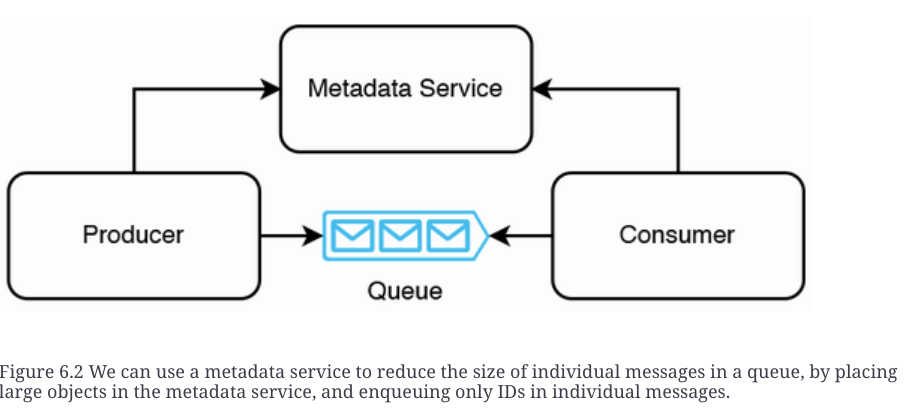

# Common Service for functional partitioning

## metadata service
+ A metadata service stores information that is used by multiple components within a system.

## library vs Service

| library | Service |
| ------- | ------- |
| Users choose which version/build to use and have more choice on upgrading to new versions.A disadvantage is that users may continue to use old versions of libraries that contain bugs or security problems fixed in newer versions.Users who wish to always use the latest version of a frequently updated library have to implement programmatic upgrades themselves. | Developers select the build and control when upgrades happen. |
| No communication or data sharing between devices limits applications. If the user is another service, this service is horizontally scaled, and data sharing between hosts is needed, the customer service’s hosts must be able to communicate with each other to share data. This communication must be implemented by the user service’s developers. | No such limitation. Data synchronization between multiple hosts can be done via requests to each other or to a database. Users need not be concerned about this. |
| Language-specific. | Technology-agnostic. |
| Predictable latency. | Less predictable latency due to dependence on network conditions. Predictable, reproducible behavior. |
| Predictable, reproducible behavior. | Network problems are unpredictable and difficult to reproduce, so the behavior may be less predictable and less reproducible. |
| If we need to scale up the load on the library, the entire application must be scaled up with it. Scaling costs are borne by the user’s service. | Independently scalable. Scaling costs are borne by the service. |
| Users may be able to decompile the code to steal intellectual property. | Code is not exposed to users. |

## rest 
+ caching
     + Expires
        + The Expires HTTP header specifies an absolute expiry time for a cached resource. 
     + Cache-Control
     + ETag
        + An ETag value is an opaque string token that is an identifier for a specific version of a resource. 
     + Last_Modified
        + The Last-Modified header contains the date and time the resource was last modified and can be used as a fallback for the ETag header if the latter is unavailable. Related headers are If-Modified-Since and If-Unmodified-Since.

## tips
+ REST
+ RPC
    + protobuf
    + Thrift
+ GraphQL
+ WebSocket

## ref
+ [Pattern: Client-side service discovery](https://microservices.io/patterns/client-side-discovery.html)
+ [Pattern: Server-side service discovery](https://microservices.io/patterns/server-side-discovery.html)