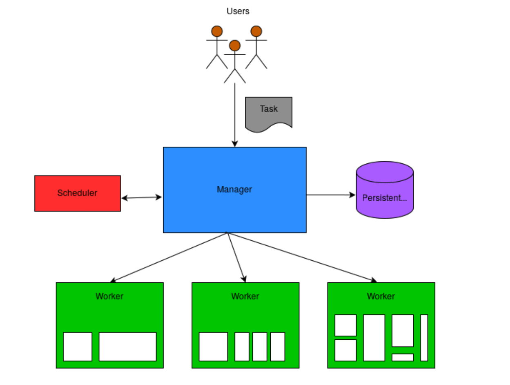

## components of an orchestration system
+ task --- (a process runs in a container)
    + The amount of memory, CPU, and disk it needs to run effectively
    + What the orchestrator should do in case of failures, often called restart_policy
    + The name of the container image used to run the task
+ job --- (an aggregation of tasks)
    + Each task that makes up the job
    + Which data centers the job should run in
    + The type of the job
+ scheduler ---- (The scheduler decides what machine can best host the tasks defined in the job.
    + Determine a set of candidate machines on which a task could run.
    + Score the candidate machines from best to worst.
    + Pick the machine with the best score.
+ manager --- (users submit their jobs to the manager. The manager, using the scheduler, then finds a machine where the job’s tasks can run. The manager also periodically collects metrics from each of its workers, which are used in the scheduling process.)
    + Accept requests from users to start and stop tasks.
    + Schedule tasks onto worker machines.
    + Keep track of tasks, their states, and the machine on which they run.
+ worker --- (It is responsible for running the tasks assigned to it by the manager.)
    + Running tasks as Docker containers.
    + Accepting tasks to run from a manager.
    + Providing relevant statistics to the manager for the purpose of scheduling tasks.
    + Keeping track of its tasks and their state.
+ cluster  --- (The cluster is the logical grouping of all the above components)
+ CLI

## tips

+ orchestrator
    + Borg
    + k8s
    + Nomad

+ BoltDB
    + embedded key/value store

+ Chi(API)
    + lightweight router 

+ goprocinfo
    + metrics

+ HA(Paxos/Raft)
    + leadership
    + consensus

+ other tools for orchestrator system
    + service discovery, HA, service meshes, and LBs

## ref

+ [Guild an orchestrator in go](https://livebook.manning.com/book/build-an-orchestration-system-from-scratch/meap-version-1/v-1/)