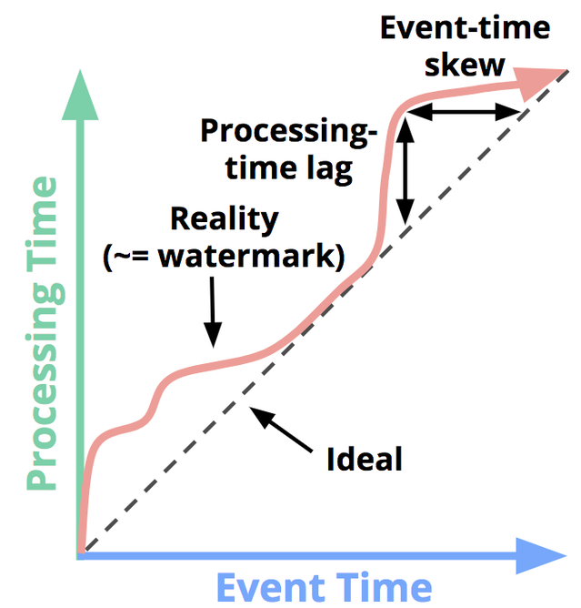

## Event Time vs Processing Time
+ Event time
    + This is the time at which events actually occurred.

+ Processing time
    + This is the time at which events are observed in the system.

+ ideal
    + event time == processing time

+ reality
    + processing time lag
        + That distance tells you how much delay is observed (in processing time) between when the events for a given time occurred and when they were processed.
    + event time skew
        +  It tells you how far behind the ideal (in event time) the pipeline is currently.

