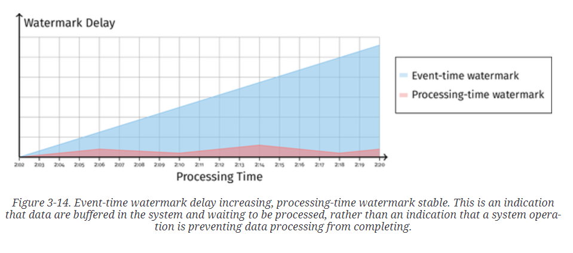
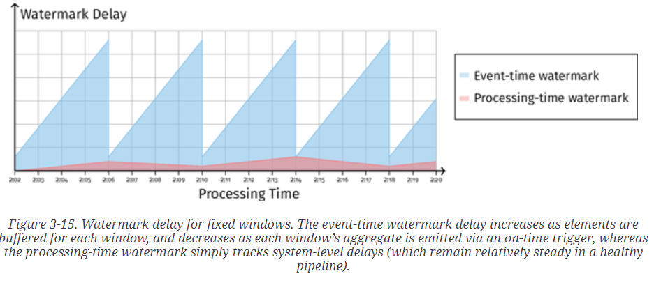

# processing-time watermark

+ the processing-time timestamp of the oldest operation not yet completed

+ processing delay
    + stuck I/O
    + exception

+ stuck system and stuck data
    + 当data delay时可以用processing-time watermark 看到是system delay还是data delay

