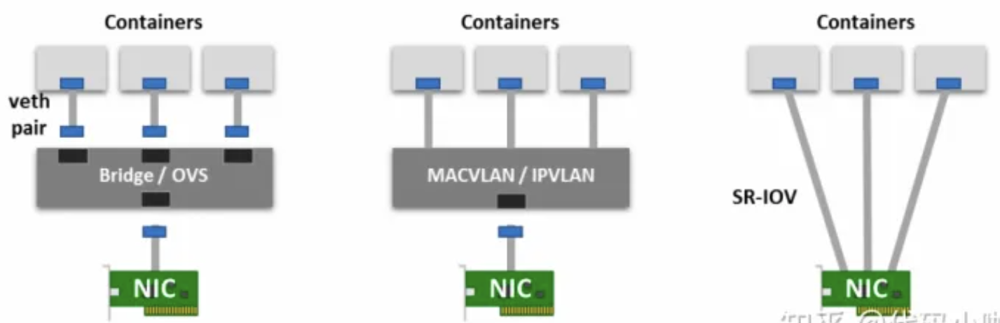

## container to container network
+ eth0
    + 通过eth0访问外部网络

+ `ip netns add ns1` create ns1 namespace
    + `ls /var/run/netns` or `ip netns`
        + 列出所有挂载点

+ 每个进程都在一个network namespace中通信
    + 默认在root network namespace中，可以访问外部

+ 同一个pod中的container在同一个namespace中，有相同的Ip和端口
    + container通过localhost相互访问

## pod to pod network
+ 每个pod都有一个内部IP

+ 同node中pod之间通信
    + root netns通过veth和pod netns通信（veth相当于网线）
    + root netns中bridge（虚拟交换机,ARP协议寻址）把不同veth端连接在一起，使得pod之间可以通信

+ 跨node pod间通信
    + 每个node都会分配一个CIDR
        + 用来给Pod分配IP
        + 路由IP数据包
    + root ns中的bridge ARP失败的时候，会把数据包发往默认路由(root netns中的eth0).通过CIDR找到正确的node

## pod to service

+ service 相当于pod的VIP
    + clusterIP
+ k8s 负载均衡
    + Linux netfilter
        + 引导包通过网络
    + iptables
        + 用户空间
        + 定义netfilter和转换数据包的规则
        + k8s中由kube-proxy配置
            + watch kube-apiserver
                + service或pod ip变化时，iptables会自动更新
            + iptables中已经做了负载均衡，将Service VIP的流量指向pod IP
    + IPVS(k8s新版本支持)
        + 构建在netfilter之上
        + 实现了linux的传输层负载均衡
        + IPVS合到LVS(linux虚拟服务器)中,可以充当服务器集群的负载均衡器（TCP,UDP）

    + kube-proxy可以选择iptables或IPVS模式
        + 使用IPVS时
            + node会创建虚拟IPVS接口
            + service的VIP会绑定到IPVS接口
            + 为每个service VIP创建IPVS服务器

+ 数据包从pod 到 service
    + pod netns eth0 ---> root netns bridge ---> root netns eth0(bridge不知道service地址会把数据包放到默认路由eth0) ---> iptables根据规则把service VIP改为目标pod IP ---> 目标pod

## 外网到service
+ engress
    + 外网网关
        + VPC 路由表中为可路由到外网的流量提供目标
        + 为已分配公共 IP 地址的实例执行网络地址转换 (NAT)
            + NAT只了解VM(node)的IP,不能处理pod IP
                + iptablse可以执行源NAT,更改数据包源,使数据包看起来来自 VM 而不是 Pod
            + 外网网关将执行另一个 NAT，将源 IP 从 VM 内部 IP 重写为公网IP
+ ingress
    + service loadbalancer
        + lb不支持container
        + 流量
            + lb --> nodes(随机挑选node) ---> node上的iptables执行NAT ----> pods
    + ingress controller
        + node port
        + ingress
            + http负载均衡
            + 将http request映射到service(根据IP路由)
        
        + 流量
            + ingress(LB) --> service ---> nodeport

## underlay network
+ 物理网络拓扑

+ L2 underlay
    + Ethernet
    + vlan

+ L3 underlay
    + Internet
    + OSPF,BGP

+ k8s中，underlay network通过宿主机作为路由器,Pod通过学习路由条目实现跨节点通信
    + flannel host-gw
        + 每个node都在L2网络中
        + node作为路由，跨节点通信通过路由表方式
    + Calico BGP(Border Gateway Protocol)
        + 去中心化自治路由协议
            + 维护IP路由表实现(Autonomous System)的可访问性，向量路由协议
    + IPVLAN & MACVLAN
        + 网卡虚化不是网络虚化，还是underlay
        + 多个IP对应一个网卡(MAC)或多个MAC对应一个IP
        + 将POD网络拉平到Node网络同级，更高性能低延迟
        + IPVLAN CNI
            + multus
            + danm

## overlay network

+ 在underlay网络上构建出虚拟网络，无需对物理网络架构更改

+ 使用一种或多种隧道协议(tunneling)，通过将数据包封装，实现一个网络到另一个网络中的传输，具体来说隧道协议关注的是数据包（帧）
    + 通用路由封装 ( Generic Routing Encapsulation )
        + 将来自 IPv4/IPv6 的数据包封装为另一个协议的数据包中，通常工作与 L3 网络层中。
    + VxLan
        + L2 的以太网帧封装为 L4 中 UDP 数据包的方法
    + IPIP

## tips

+ CIDR(Classless Inter-Domain Routing)无类别域间路由
    + 用于分配IP,路由IP数据包

+ pause container
    + pod中建立共享的veth0网络接口

## ref

+ [16 张图硬核讲解 Kubernetes 网络模型](https://zhuanlan.zhihu.com/p/555185137)
+ [K8S网络之Pod网络](https://mp.weixin.qq.com/s/eKcSIU9w-Q_AHumgbC8DUA)
    + pod跨node通信
        + 路由(underlay)
        + CNI(overlay)
+ [Kubernetes网络模型](https://mp.weixin.qq.com/s/ennOLcCVUernHkgmPj4ung)
+ [k8s service](https://www.zhihu.com/question/359649715/answer/2792064190)
+ [数据包在 Kubernetes 中的一生](https://blog.fleeto.us/post/life-of-a-packet-in-k8s-1/)

+ [一文搞懂Kubernetes的网络模型：Overlay和Underlay](https://jishuin.proginn.com/p/763bfbd5be01)
+ [干货分享| Kubernetes网络难懂？可能是没看到这篇文章](https://zhuanlan.zhihu.com/p/526586444)
+ [集群网络系统](https://kubernetes.io/zh/docs/concepts/cluster-administration/networking/)
+ [16 张图硬核讲解 Kubernetes 网络模型******k8s网络*****](https://zhuanlan.zhihu.com/p/555185137)
