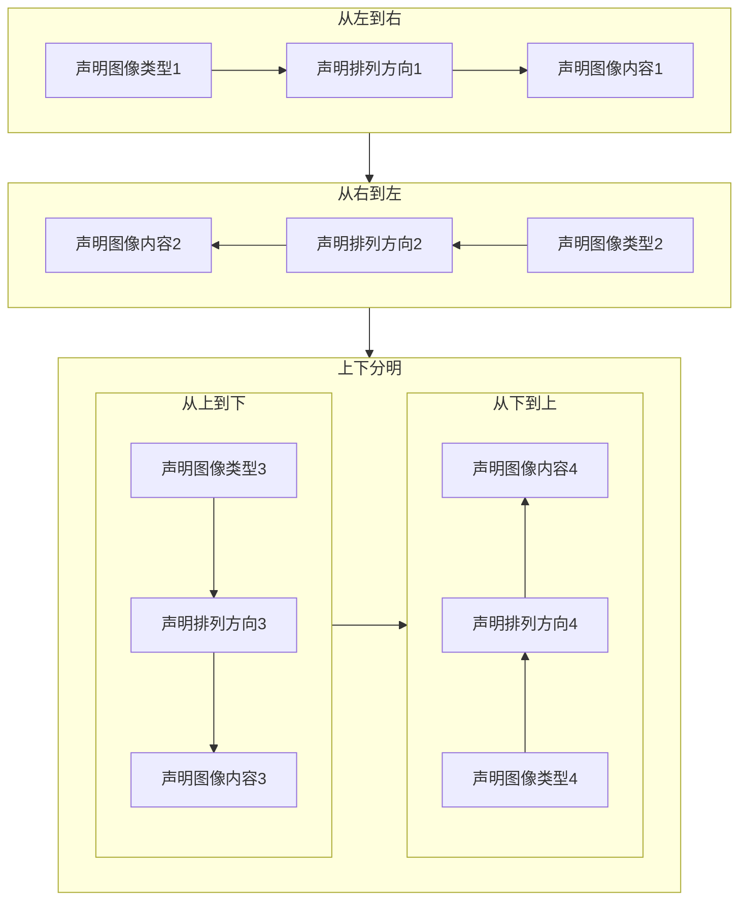

```mermaid
    flowchart TB
    subgraph 从左到右
        direction LR
        声明图像类型1 --> 声明排列方向1 --> 声明图像内容1
    end
    subgraph 从右到左
        direction RL
        声明图像类型2 --> 声明排列方向2 --> 声明图像内容2
    end
    subgraph 上下分明
        direction LR
        subgraph 从上到下
        direction TB
        声明图像类型3 --> 声明排列方向3 --> 声明图像内容3
        end
        subgraph 从下到上
        direction BT
        声明图像类型4 --> 声明排列方向4 --> 声明图像内容4
        end
        从上到下 --> 从下到上
    end
    从左到右 --> 从右到左 --> 上下分明
```
