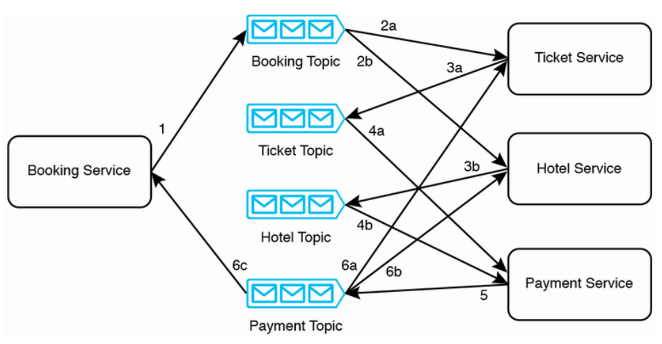
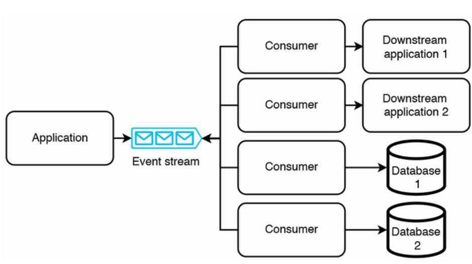
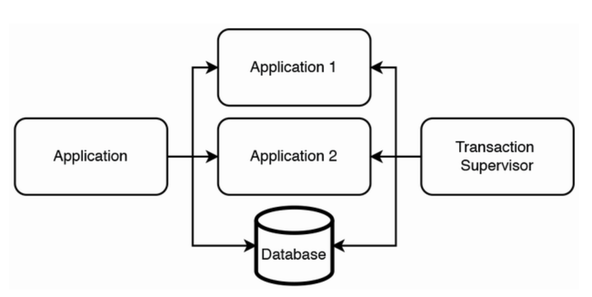

# 分布式事物
+ 分布式数据库事务
    + 跨分布式数据库节点的数据操作
+ 跨服务跨库分布式事务
    + 这类事务涉及的是微服务架构中的服务间交互

## 2PC
+ 事务管理器（事务管理器分两个阶段来协调资源管理器）
    + 第一阶段
        + 准备资源，也就是预留事务所需的资源，如果每个资源管理器的资源都预留成功（例如对数据加锁）
    + 第二阶段
        + 若第一阶段成功，则将资源提交（数据处理完后释放锁），否则协调资源管理器回滚资源（对数据释放锁）
+ 资源管理器
    + 数据源

+ 故障
    + 参与者故障
        + 假如在第一阶段有一个参与者返回 prepare 失败或者某个参与者超时，那么协调者就会向所有参与者发送回滚事务的请求，即分布式事务执行失败。
        + 假如第二阶段参与者回滚或提交失败，只能一直重试直到成功，必要条件下需要人工处理。
    + 协调者故障
        + 假设协调者在发送准备命令之后挂了，参与者执行了 prepare 处于事务资源锁定的状态。 但由于协调则故障不仅分布式事务执行不下去，还会因为锁定了公共资源而阻塞其它事务。
        + 假设协调者在发送 rollback 或 committ 之后挂了，命令发出去了，参与者 rollback/commit 成功，资源都会释放。但是如果出现网络问题，某些参与者将因为收不到命令而阻塞着，此时还是会导致分布式事务失败。

+ 缺点
    + 使用锁影响并发性能
    + 协调者复杂，需要记录参与者的锁定信息，已经集群化保证高可用
    + 多次网络通信产生性能开销

## Percolator
+ 2PC优化版
+  Percolator模型通过将提交过程中的第一个参与者设计为类似2PC中的协调者角色，从而避免了需要特殊实现的协调者。
+ Percolator模型采用了全局授时服务（TSO），它为每个事务分配一个全局唯一且递增的时间戳。这个时间戳用于确保事务操作的顺序性和一致性，使得即使在分布式环境下，也能够实现多版本的并发控制（MVCC）。

## XA事物
+ XA 事务延续了 2PC的思想，XA 事务主要是面向操作 多个数据库的场景
+ 全局事务管理器(TM)和(局部)资源管理器(RM)
+ XA 事务和本地(非 XA )事务互相排斥
    + 如果已经通过 XA START 来开启一个事务，则本地事务不会被启动，直到 XA 事务被提交或者被回滚为止。相反的，如果已经使用 START TRANSACTION 启动一个本地事务，则 XA 语句不能被使用，直到该事务被提交或者回滚为止，这样的机制会导致数据库并发性能严重下降。
+ 第一阶段（prepare）：即所有的参与者RM准备执行事务并锁住需要的资源。参与者ready时，向TM报告已准备就绪。
+ 第二阶段 (commit/rollback)：当事务管理者(TM)确认所有参与者(RM)都ready后，向所有参与者发送commit命令。

## TCC
+ Try 阶段：
    + 尝试执行，完成所有业务检查, 预留必须业务资源。
+ Confirm 阶段：
    + 如果所有分支的Try都成功了，则走到Confirm阶段。Confirm真正执行业务，不作任何业务检查，只使用 Try 阶段预留的业务资源。
+ Cancel 阶段：
    + 如果所有分支的Try有一个失败了，则走到Cancel阶段。Cancel释放 Try 阶段预留的业务资源。

+ TCC 主要面向应用层，需要通过改造业务接口来实现。
    + 业务逻辑的每个分支都需要实现 Try、Confirm、Cancel 三个操作，除此之外需要对数据表中新增 冻结字段（根据业务确定） 实现对数据资源的锁定。
    + 一旦出现异常则通过 Cancel 来进行回滚事务进行补偿，这也就是常说的补偿性事务。
## SAGA
+ saga其核心思想是将长事务拆分为多个本地短事务
    + 由 saga事务协调器协调依次让每个微服务执行本地事务，如果操作成功那接着执行下一个微服务的本地事务。如果某个微服务失败，则根据相反顺序每个微服务都调用补偿操作
+ A saga is a pattern to help manage failures.
+ A typical saga implementation involves services communicating via a message broker like Kafka or RabbitMQ.
+ 优点
    + 吞吐量
        + 在这种模式下，分布式事务中微服务的每个本地事务（如A->B->C->D）都是直接进行的，没有预占资源的过程。这意味着事务的每个步骤都是独立的，所以且可以异步执行，这种设计使得Saga模式适合处理长流程的业务场景，并且由于其异步性，能够带来更高的吞吐量。
+ 缺点
    + 隔离性
        + 在Saga模式中，（如A->B->C->D）如果B和C操作成功，但D操作失败，那么在D操作失败到整个分布式事务回滚之前，如果有其他用户读取B、C和D的值，他们可能会读到尚未最终确定的“脏数据”
+  VS TCC
    + 在TCC模式中，由于Try阶段会锁定资源，其他用户在事务完成之前无法读取到这些资源，因此不会读到“脏数据”。这保证了TCC模式在事务处理过程中的数据一致性和隔离性。 
    + 在处理分布式事务时，TCC模式通过两阶段提交策略确保了事务的隔离性和一致性，而Saga模式虽然在吞吐量上有优势，但在隔离性方面存在一定的风险。
+ coordination
    + choreography (parallel) 
        + the service that begins the saga communicates with two Kafka topics. It produces to one Kafka topic to start the distributed transaction and consumes from another Kafka topic to perform any final logic.
        + compensable transactions
            +  which can be rolled back by compensating transactions
        +  pivot transaction
            + Transactions after the pivot transaction can be retried until they succeed
        
    + orchestration (linear)
        + the service that begins the saga is the orchestrator
            + The orchestrator communicates with each service via a Kafka topic
            + In each step in the saga, the orchestrator must produce to a topic to request this step to begin, and it must consume from another topic to receive the step’s result.
            + An orchestrator is a finite-state machine that reacts to events and issues commands. 
            + The orchestrator must only contain the sequence of steps.
            +  It must not contain any other business logic, except for the compensation mechanism.
        

    + choreography vs orchestration

| choreography | orchestration	| 
| -------- | -------- | 
| Requests to services are made in parallel. This is the observer object-oriented design pattern. | Requests to services are made linearly. This is the controller object-oriented design pattern. |
| The service that begins the saga communicates with two Kafka topics. It produces one Kafka topic to start the distributed transaction and consumes from another Kafka topic to perform any final logic.  |  The orchestrator communicates with each service via a Kafka topic. In each step in the saga, the orchestrator must produce to a topic to request this step to begin, and it must consume from another topic to receive the step’s result. |
|The service that begins the saga only has code that produces to the saga’s first topic and consumes from the saga’s last topic. A developer must read the code of every service involved in the saga to understand its steps.   | The orchestrator has code that produces and consumes Kafka topics that correspond to steps in the saga, so reading the orchestrator’s code allows one to understand the services and steps in the distributed transaction.  |
| A service may need to subscribe to multiple Kafka topics, such as the Accounting Service in figure 5.5 of Richardson’s book. This is because it may produce a certain event only when it has consumed certain other events from multiple services. This means that it must record in a database which events it has already consumed.  | Other than the orchestrator, each service only subscribes to one other Kafka topic (from one other service). The relationships between the various services are easier to understand. Unlike choreography, a service never needs to consume multiple events from separate services before it can produce a certain event, so it may be possible to reduce the number of database writes.  |
|  Less resource-intensive, less chatty, and less network traffic; hence, it has lower latency overall. | Since every step must pass through the orchestrator, the number of events is double that of choreography. The overall effect is that orchestration is more resource-intensive, chattier, and has more network traffic; hence, it has higher latency overall.  |
| Parallel requests also result in lower latency.  | Requests are linear, so latency is higher.  |
|  Services have a less independent software development lifecycle because developers must understand all services to change any one of them. | Services are more independent. A change to a service only affects the orchestrator and does not affect other services.  |
| No such single point of failure as in orchestration (i.e., no service needs to be highly available except the Kafka service).  |  If the orchestration service fails, the entire saga cannot execute (i.e., the orchestrator and the Kafka service must be highly available). |
|  Compensating transactions are triggered by the various services involved in the saga. | Compensating transactions are triggered by the orchestrator.  |

## 消息型事务
+ 消息事务的原理是将两个本地事务通过消息中间件进行异步解耦，适用的场景主要是那些需要异步更新数据，并且对数据实时性要求不太高的场景
+ 轮询机制： 
    + MQ 针对半事务消息会有一个轮询任务，倘若半事务消息一直未收到来自 消费者 侧的二次确认，则 MQ 会持续主动询问 消费者 侧本地事务的执行状态，从而引导半事务消息走向终态
+ 下游消费者操作失败：
    + 倘若接收消息的下游消费者执行操作失败，此时至多只能依赖于 MQ 的重发机制通过重试动作的方式提高执行成功率，如果还不行只能人工解决。
<!-- process -->
+ 生产者首先向 MQ 生产一条半事务消息，此消息处于中间态，会暂存于MQ 不会被立即发出
+ 如果本地事务执行成功，生产者直接提交本地事务，并且向 MQ 发出一条确认消息，如果本地事务执行失败，消费者向MQ发出一条回滚指令
+ 倘若 MQ 接收到确认消息，则会执行消息的发送操作，供下游消费者消费
+ 倘若 MQ 接收到回滚指令，则会删除对应的半事务消息，不会执行实际的消息发送操作

## brief
| 特性/模型 | XA	| TCC |	Saga	| 消息型事务 |
| -------- | --- | ---- | ----- | ------- |
| 适用场景 | 适用于跨多个数据库实例的事务处理，并发要求不高的业务。| 适用于需要强一致性的业务场景，且各个服务的接口能够改造为 Try-Confirm-Cancel模式。	| 适用于长事务和复杂业务流程，允许最终一致性。|	适用于异步业务处理，解耦服务间直接调用，允许最终一致性。|
| 一致性强弱 |	强一致性 |	较强一致性 |	最终一致性	| 最终一致性 |
| 并发度 |	并发度低 | 并发度低	| 并发度高	| 并发度高 |
| 缺点	| 对于性能有一定影响，并发度较低。|	实现复杂，需要为每个接口定义Try、Confirm、Cancel。|	可能出现数据脏读情况。|	消息传递可能存在延迟，不能保证实时一致性。|

## Event Driven Architecture(EDA)
+ asynchronous and non-blocking
+ examples
    + Event sourcing
        + Event sourcing is a pattern for storing data or changes to data as events in an append-only log.
        + Any write must first be made to the event log,After this write succeeds, one or more event handlers consume this new event and writes it to the other databases.
        + event log 
            + kafka
    
    + Change data capture(CDC)
        + logging data change events to a change log event stream and providing this event stream through an API.
        + event stream
            + consumer
        + transaction log miners.
            + One way to handle duplicate events is to use the message broker’s mechanisms for exactly-once delivery.
            +  the events to be defined and processed idempotently.
    + event sourcing VS CDC
        + CDC ensures consistency and lower latency than event sourcing
            + Each request is processed in near real time
            + unlike in event sourcing where a request can stay in the log for some time before a subscriber processes it.
        + CDS propagates events to consumers. 
            + Event sourcing need subscribers to pull events from event log.
        + you might use both event sourcing and CDC together
            + you can use event sourcing within a service to record data changes as events, while using CDC to propagate those events to other services. 
    
|  | Event Sourcing	| Change Data Capture (CDC) |
| -------- | --- | ---- |
| Purpose | Record events as the source of truth. | Synchronize data changes by propagating events from a source service to downstream services. |
| Source of truth | The log, or events published to the log, are the source of truth. | A database in the publisher service. The published events are not the source of truth. |
| Granularity | Fine-grained events that represent specific actions or changes in state. | Individual database level changes such as new, updated, or deleted rows or documents. |

## Transaction supervisor
+ A transaction supervisor is a process that ensures a transaction is successfully completed or is compensated.
+ It can be implemented as a periodic batch job or serverless function.

## tips
+ Quorum writes
+ Paxos and EPaxos
+ Raft
+ Zab (ZooKeeper atomic broadcast protocol) – Used by Apache ZooKeeper.

## ref
+ [分布式事务](https://zhuanlan.zhihu.com/p/689637642)
+ [Saga](https://microservices.io/patterns/data/saga.html)